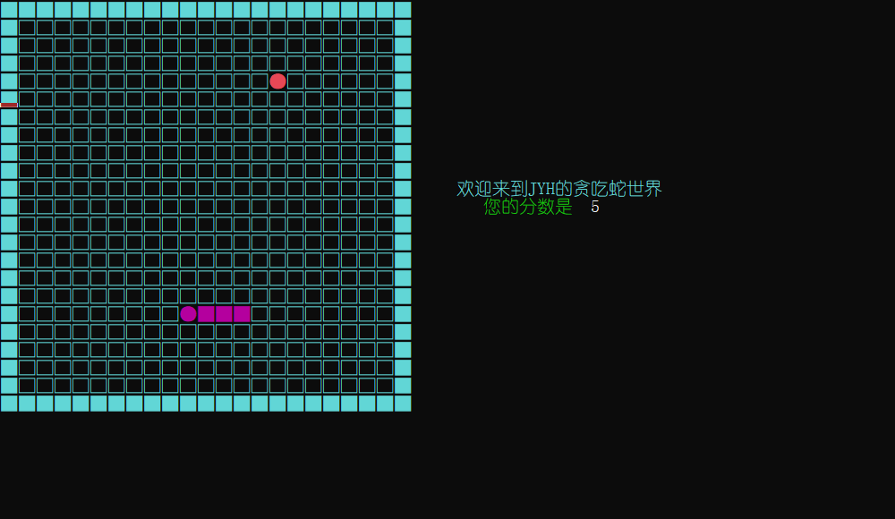

# 控制台小游戏——贪吃蛇

## 项目概览

**运行环境：**Window10 + VS2019, 因使用`window.h`头文件因此必须在windows平台运行

**结果展示:**



## 1	课程设计目标

以经典贪吃蛇为基础参考 

- 地图四面围墙，
-  玩家用键盘方向键控制蛇移动，每次吃掉一个食物，蛇的长度加一
- 并在地图上随机产生一 个新食物 每吃掉5个普通食物后，附加多产生一个限时食物，在给定的移动步数(比如30格)之后会自动消失 
- 游戏中时刻显示分数 

## 2    设计思路

游戏有3个核心概念：蛇、食物、地图

- 蛇：由多个格子组成，会在地上一格一格地移动，第一个格子始终向前移动，受到玩家到控制后可以转弯。蛇吃了食物后还能变长。这个用链表来处理更加合适，可以随意增加节点。可以借助STL中的`list`实现

- 苹果：数据很简单，只有一个位置，只要一个表示坐标的数据结构即可。

  

- 地图用一个二维数组表示即可，在二维数组的边缘定义墙

## 3.类的实现与操作

本程序用 `Point`表示点的坐标类

```C++
struct Point
{
	int x;
	int y;
};
```

用枚举类型`Direction`表示蛇移动的方向

```C++
enum Direction
{
	up,down,left,right
};
```


包括四个类:`Snake、Food、Map、Game`

### `Snake`类

```C++
class Snake
{
private:
	static list<Point> body;  //蛇身
	int lenth;        //蛇长
	static int num_move;     //移动次数
	Direction dir;   //方向
	bool isalive;     //是否存活
	int score;       //分数
public:
	friend class Game;  //定义Game类为友元
	friend class Food;  //定义Food类为友元
	Snake() { Reset(); }
	~Snake() {}
	void ChangeDir(Direction set_dir);  //改变蛇前行方向
	void Move();     //蛇前移
	void Draw();     //画出蛇
	void Reset();    //初始化操作
	void Dead();     //判断蛇是否死亡
	bool IsDie() { return !isalive; }  //对外接口，返回蛇当前状态(是否死亡)
};
```


对`Snake`类的关键操作在于`ChangeDir(Direction set_dir)`, `Move()`

- 对于`ChangeDir(Direction set_dir)`

  通过改变`Snake`的私有成员`dir`的值，来实现改变蛇的方向

  ```C++
  void Snake::ChangeDir(Direction set_dir)
  {
  	//首先判断蛇的移动是否常识
  	if (set_dir == Direction::up && dir == Direction::down
  		|| set_dir == Direction::down && dir == Direction::up
  		|| set_dir == Direction::left && dir == Direction::right
  		|| set_dir == Direction::right && dir == Direction::left)
  	{
  		return;
  	}
  	dir = set_dir;
  }
  ```

- 对于`move()`

  ```C++
  	// 先将蛇的尾巴置为空
  		Point tail = { body.back().x,body.back().y };
  		gotoXY(tail.x, tail.y);
  		setColor(11);
  		cout << "□";
  		num_move++;
  
      //根据蛇当前方向，将蛇身包括蛇头全部往前移一位
  		list<Point>::iterator it = body.begin();
  		int pre_x = (*it).x; //临时存放即将改变的坐，方便后续坐标的改变
  		int pre_y = (*it).y;
  
  		it->x += Xoffset[dir]; //改变蛇头坐标
  		it->y += Yoffset[dir];
  		it++;
  		for (; it != body.end(); it++) //将后续蛇结点全部前移
  		{
  			int tmp_x = it->x;
  			int tmp_y = it->y;
  
  			it->x = pre_x;
  			it->y = pre_y;
  
  			pre_x = tmp_x;
  			pre_y = tmp_y;
  		}
  ```

### `Food`类

```C++
class Food
{
private:
	static Point pos;  //普通食物坐标
	static Point pos2; //限时食物坐标
	int val;  //标记食物的出现，五次OrdinaryFood 一次LimitedFood
public:
	friend class Game;
	Food() { Reset();  }
	~Food() {}
	void Reset() { val = 0; FoodUpdate(); }
	void FoodUpdate(); 
	void OrdinaryFood();
	void LimitedFood();
	bool Overlap(Point p, list<Point>& q);  //判断食物的出现是否与蛇身重叠
};
```

`Food`类的实现十分简单，只要运用好随机函数`rand()`随机定义食物的坐标，并打印即可，在此不在赘述。

### `Map`类

```C++
class Map
{
private:
	bool board[N + 5][N + 5];
public:
	Map() { Reset(); }
	~Map(){}
	void Reset();  //初始化
};
```

`Map`类的实现更为简单了，只需整个画面，命名墙与非墙即可

- ```C++
  void Map::Reset()
  {
  	//初始化地图与墙
  	memset(board, false, sizeof(board));
  	for (int i = 1; i <= N; i++)
  		for (int j = 1; j <= N; j++) {
  			board[i][j] = true;
  		}
  	setColor(11);
  	for (int i = 0; i <= N + 1; i++) {
  		for (int j = 0; j <= N + 1; j++) {
  			if (board[i][j]) cout << "□";
  			else cout << "■";
  		}
  		cout << endl;
  	}
  	gotoXY(25, 10);
  	cout << " 欢迎来到JYH的贪吃蛇世界" << endl;
  	gotoXY(27, 11);
  	setColor(10);
  	cout << "您的分数是";
  }
  ```

### `Game`类

​	`Game`类，主要进行上述三类之间操作，并定义游戏进程

```C++
class Game
{
private:
	bool GameState;
	Map map;
	Food food;
	Snake snake;
	int cur_move;

public:
	Game() { GameState = true; cur_move = 0; }
	bool IsKeyDown(int key); //判断键是否按下
	void KeyboardControl();  //判断什么键按下
	bool EatOrdinaryFood(list<Point>& body, Point pos);	//吃到普通食物
	bool EatLimitedFood(list<Point>& body, Point& pos2);//吃到限时食物
	void Running(); //游戏进程
};
```

在键盘操作函数这里引用了Windows的API，摒弃通过`getch()`的简易键盘操作，感觉代码质量又上升了一层......

```C++
bool Game::IsKeyDown(int key) //键是否按下
{
	return (GetAsyncKeyState(key) & 0x8000 ? 1 : 0);
}
void Game::KeyboardControl()
{
	if (IsKeyDown(VK_ESCAPE)) // esc键按下则退出循环结束游戏
	{
		GameState = false;
		return;
	}
	if (IsKeyDown(VK_LEFT))   //方向左键是否按下
	{
		snake.ChangeDir(Direction::left);
	}
	if (IsKeyDown(VK_RIGHT))  //方向下键是否按下
	{
		snake.ChangeDir(Direction::right);
	}

	if (IsKeyDown(VK_UP))    //方向上键是否按下
	{
		snake.ChangeDir(Direction::up);
	}

	if (IsKeyDown(VK_DOWN)) //方向下键是否按下
	{
		snake.ChangeDir(Direction::down);
	}
}
```

最关键的还是`Snake`类与`Food`的交互，这里以`EatLimitedFood(list<Point>& body, Point& pos2)`为例：

```C++
bool Game::EatLimitedFood(list<Point>& body, Point& pos2)
{
	if (body.front().x == Food::pos2.x && body.front().y == Food::pos2.y)
	{
		Point tmp = body.back(); //将尾巴复制一遍
		body.push_back(tmp);     //再插入到尾巴，增长
		snake.lenth++;
		snake.score += 10;
		pos2.x = 0; pos2.y = 0;  //限时食物归0，消失
		return true;
	}
	return false;
}
```

还有游戏进程函数`Running`，当`Running`函数结束时，意味着你GameOver了

```C++
void Game::Running()
{
	while (!snake.IsDie() && GameState)
	{
		KeyboardControl();
		snake.Move();
		snake.Dead();
		EatOrdinaryFood(snake.body, food.pos);
		if (food.val == 5) //用val来实现吃五次Ordinary，出现一层Limited
		{
			EatLimitedFood(snake.body, food.pos2);
			if (cur_move == 0) //实现蛇走三十格后，限时食物消失
				cur_move = snake.num_move;
			if (snake.num_move - cur_move == 30 && !(food.pos2.x != 0 && food.pos2.y != 0))
			{
				gotoXY(food.pos2.x, food.pos2.y);
				cout << "□";
			}
		}
		Sleep(200);//延时，可通过此控制蛇移动速度
	}
	gotoXY(N / 2, N / 2);
	cout << " 游戏结束  ";
	gotoXY(0, N + 5);
}
```


## 4.遇到的问题与解决方案

JYH遇到的问题太多了.....疯狂Debug，真是朴实、无华且头秃。

当然遇到的最关键问题就是贪吃蛇的游戏界面,身为cj的我只会用字符界面实现游戏界面，并通过`system("cls")`不断刷屏，实现视觉上贪吃蛇的移动。但用`system("cls")`明显感觉到屏幕不停的闪烁，让游戏者毫无游戏感。

好在CSDN大佬的帮助下，学到了Windows API `SetConsoleCursorPosition`函数，

```C++
void gotoXY(int x, int y)
{
	COORD pos{ x*2 , y };
	HANDLE Hout = GetStdHandle(STD_OUTPUT_HANDLE); //获取句柄
	SetConsoleCursorPosition(Hout, pos);  //移动光标
}
```

通过此函数移动屏幕光标，来打印自己在屏幕中任意位置想打印的符号，真是方便的不得了，就不用通过刷屏的形式，每移动一次，就刷新屏幕，重新打印一次，效率太低。

通过这次的课程设计，感悟万千。读万卷书，行万里路，必须多看大佬的高效代码，并运用到自己的程序中，熟练掌握一些编程技巧、接口函数，能大大提高自己的编程能力。


​																							**181870080 姜玉骅**

​																								    **于2019.10.13**