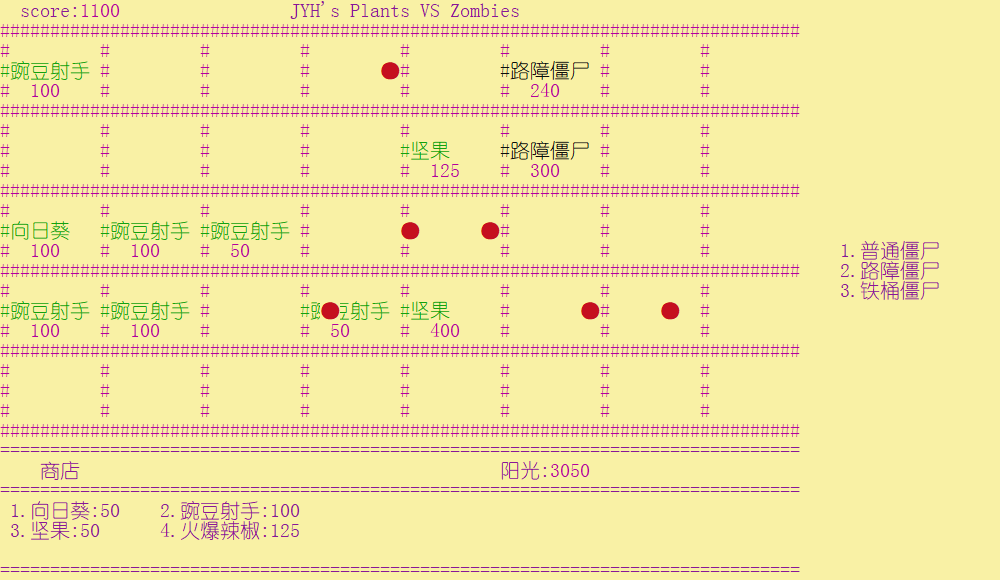

# 课程设计二——植物大战僵尸

## 1.主要内容

- 庭院布局五行八列，其中第八列为僵尸预登场的地方，植物无法种植，子弹无法打到
- 实现三种僵尸：普通僵尸、路障僵尸、铁桶僵尸
- 实现四种僵尸属性：生命值、攻击力、攻击速度、移动速度
- 实现四种植物：向日葵、豌豆射手、坚果、火爆辣椒
- 实现四种植物属性：生命值、购买所费阳光数、攻击力、攻击速度
- 每块地块只会有一个僵尸或植物
- 普通僵尸、路障僵尸、铁桶僵尸，分别以3/5,1/5，1/5随机在庭院任意一列出现
- **按下键盘1,2,3,4进入向日葵、豌豆射手、坚果、火爆辣椒的选地皮环节**，地图中出现一个紫色的方块，表示当前地皮正在被选中，按下回车键，即将选中植物种植到当前地皮。若当前地皮存在僵尸或其他植物，则不会进行操作**（注：当前阳光数需多于购买植物所需阳光数）**
- 界面左上角为计分板，击杀普通僵尸加50分，击杀路障僵尸加100分，击杀铁桶僵尸加200分

`CUI`界面如图所示

注：**植物或僵尸下方数字代表当前生命值**



## 2.类的设计

本次课程设计中，类主要有`Game`类（IO与游戏逻辑）,`Base`抽象类(派生出各个植物和僵尸类)，`Bullet`类（子弹相关）。

---


`Base`类派生出`SunFlower`、`PeaShooter`、`Nuts`、`HotPepper`、`NormalZombie`、`ConeZombie`、`BucketZombie`七个类

`Base`类定义如下:

```C++ 
class Base
{
protected:
	int damage;		//攻击力
	int speed;		//速度
	int attackspeed;//攻击速度
	int price;		//购买需要阳光数
public:
    int life;		//生命值
	point pos;		//坐标
	int tag;		//标记植物或僵尸的类别
	Base(point p,int t=0);
	virtual ~Base();
	virtual void Action() = 0;   //每个植物或僵尸的特点/动作
};
```

其中包括一个**纯虚函数**，在派生类中实现，以表示植物和僵尸的道具或功能

其中成员变量`pos`表示该类在庭院矩阵中的位置，

成员变量`tag`用以区分植物和僵尸的类别，同时庭院矩阵一个点值就为该类tag值，方便交互与UI绘制

```C++
switch (coordinate[h][i])
{
    case 1:setColor(226); cout<< "#向日葵   "; break;
    case 2:setColor(226); cout << "#豌豆射手 "; break;
    case 3:setColor(226); cout << "#坚果     "; break;
    case 4:setColor(226); cout << "#火爆辣椒 "; break;
    case -1:setColor(224); cout << "#普通僵尸 "; break;
    case -2:setColor(224); cout << "#路障僵尸 "; break;
    case -3:setColor(224); cout << "#铁桶僵尸 "; break;
    default:
        setColor(237); cout << "#         "; break;
}
```

`Base`派生的植物中以豌豆射手为代表：

```C++
class PeaShooter :public Base
{
private:
	unsigned long long recordTick;	//时间时钟
public:
	PeaShooter(point pos, int t = 0);
	~PeaShooter();
	void Action();
};
```

相比于基类多增加了一个时间时钟，以实现攻击速度的实际价值。并具体实现了`Action`函数

`Base`派生的僵尸以普通僵尸为代表

```C++
class NormalZombie :public Base
{
private:
	unsigned long long recordTick;	//时间时钟
public:
	NormalZombie(point pos, int t = 0);
	~NormalZombie();
	void Walk();
	void Attack();
	void Action();
};
```

同样多增加了一个时钟类，并多增加了两个成员函数`Walk()`  `Attack()`，以表示移动和攻击，并在`Action`中调用两函数

---

`Game`类主要负责游戏的逻辑处理和输入输出

```C++
class Game
{
private:
	static int coordinate[8][5]; //庭院矩阵,每一个点表示植物或僵尸的类别
	static Base* BaseTable[8][5];   //庭院矩阵，每一个点表示一个植物或僵尸
	static list<Bullet*> BulletTable; //记录子弹的list
	static int sunshine;  //阳光
	static int score; //计分板
	point shop_pos;//购买地皮时所用坐标
	bool Isbuy;//是否处于购买植物的状态
	int tag; //标记购买植物时，当前选中的植物
	unsigned long long recordtick;
public:
	static bool state; //游戏进行的状态，false表示游戏结束
	Game();
	~Game() {}
	friend class Base;
	friend class SunFlower;
	friend class PeaShooter;
	friend class HotPepper;
	friend class NormalZombie;
	friend class ConeheadZombie;
	friend class BucketZombie;
	friend class Nuts;
	friend class Bullet;
	void Init();  //初始化，打印不需要刷新的界面
	void UpdateDraw(); //刷新界面
	void KeyBoardControl(); //监控键盘输入
	void Processing();  //游戏进程的处理
	void BulletUpdate(); //子弹的更新
	void ZombiesUpdate(); //僵尸的更新
};
```

---

`Bullet`子弹类尤其简单

```C++
class Bullet
{
private:
	point pos;//子弹坐标
	int damage;//伤害
public:
	friend class Base;
	friend class Game;
	Bullet(point p);
	~Bullet();
	void Action();//动作，改变子弹坐标，控制移动
};
```

## 3.类的交互

### 植物、僵尸与庭院的交互

植物和僵尸对象的使用是通过基类指针`Base*`来表示的，`Game::BaseTable`为一个`Base*`实例的二维矩阵，在每次迭代时，`Game`类都会遍历`BaseTable`矩阵以刷新庭院。

当创建植物或僵尸时便通过以下方式：

创建植物时

```C++
switch (tag)
{
case 1: 
if (sunshine < 50) return; BaseTable[shop_pos.x][shop_pos.y] = new 			SunFlower(shop_pos, 1); sunshine -= 50;  break;
        
case 2:	
if (sunshine < 100) return; BaseTable[shop_pos.x][shop_pos.y] = new 		PeaShooter(shop_pos, 2); sunshine -= 100;break;
        
case 3:	
if (sunshine < 50) return;  BaseTable[shop_pos.x][shop_pos.y] = new 		Nuts(shop_pos, 3); sunshine -= 50;  break;
        
case 4:	
if (sunshine < 125) return;  BaseTable[shop_pos.x][shop_pos.y] = new 			HotPepper(shop_pos, 1); sunshine -= 50; break;
```


创建僵尸时

```C++
switch (tag)
{
case 1:BaseTable[7][y] = new NormalZombie({ 7,y }, -1);break;
case 2:BaseTable[7][y] = new ConeheadZombie({ 7,y }, -2); break;
case 3:BaseTable[7][y] = new BucketZombie({ 7,y }, -3); break;
default:
break;
}
```

并在`Base`的构造函数和析构函数中，实现对`coordinate`、`BaseTable`两个矩阵的更新

植物和僵尸，生命值为0，即调用其析构函数

```C++ 
Base::Base(point p, int t) //Constructor
{
	pos = p;
	tag = t;
	attackspeed = 0;
	damage = 0;
	life = 0;
	price = 0;
	speed = 0;
	Game::coordinate[pos.x][pos.y] = tag;
}

Base::~Base() //Destructor
{
	Game::coordinate[pos.x][pos.y] = 0;
	Game::BaseTable[pos.x][pos.y] = NULL;
}
```

### 植物与僵尸交互

**豌豆射手**会根据攻击速度**每隔一段时间会创建一个新的子弹对象**，并将该子弹对象记录到`list`中，子弹一被创建坐标即不断在被改变。**要么子弹出庭院的边界消亡，要么子弹坐标与僵尸重合时消亡**。在第二种情况下，**僵尸**的**生命值**会根据子弹的`damage`值**减少**。

同时僵尸也在不断移动，也会对植物发起攻击。在`BaseTable`矩阵中，若僵尸的前一个元素为空**(tag==0)**，则僵尸在经过一段时间后，移动到其前一个位置，若僵尸的前一个元素为植物(**tag>0**),则僵尸不移动，对植物发起攻击，根据僵尸的攻击速度，植物每隔一段时间扣除一部分生命值。

当僵尸在`BaseTable`矩阵中的横坐标为0，并又即将执行`Walk()`函数时，僵尸进入屋子，游戏结束。


### 4.遇到的问题和解决方案

若干问题：

1. **每次游戏界面更新，屏幕闪烁：**

   原因：

   一次迭代用了大量光标移动，效率太低，在下一帧出现时，上一帧的界面还没打完

   解决方法：

   减少光标移动函数，每次迭代将光标移到(0,0)，重新打印，遇到空白的地方，打印空格，不使用光标移动跳过

2. **创建植物或僵尸后，不知如何用什么数据结构表示以遍历调用每个植物和僵尸的道具**

   原因：

   一开始植物和僵尸分别作为基类，派生出向日葵、豌豆射手和普通僵尸、路障僵尸等，植物和僵尸相互独立，难以统一以庭院的方式管理

   解决方法：

   将植物和僵尸的基类合并为`Base`,用以`Base*`为实例的二维矩阵来表示庭院，方便管理与游戏逻辑的处理


就此JYH的课程设计二终于完成，程序员的生活真是朴实、无华且头秃.......

(但写完的那一刻还是蛮开心的)

**JYH 于2019.11.15**

